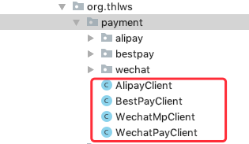
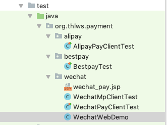

糖葫芦支付
============
> 基于Java实现的 多平台支付 依赖库。

[TOC]

### 适用人群
未接触过支付，觉得官方文档复杂, 但又需要快速接入支付功能的小白程序员，这个项目一定会让你省下不少力气，如果你是之前接入过各种支付的老鸟,这对你可能没什么吸引力，这个项目主要面向刚接触或未接触过支付的小伙伴，无论你是小白还是老鸟，喜欢的话帮忙star下，感谢。

### 特性说明
- 整合多主流种支付平台于一体(支付宝、微信、翼支付)
- 接口参数全部封装，使用者仅需创建对象并设置参数
- 项目极少依赖，接口简单清晰，日志详细且输出格式友好
- 各种支付平台，支付场景提供示例项目，新手更容易上手，降低接入门槛
- 微信模块整合了公众号相关功能(openId获取,微信通知,用户信息获取等)

### 支付功能
- 微信公众号支付(微信JSAPI)
- 微信刷卡付款(商家扫码支付)
- 微信扫码支付(用户扫码支付)
- 支付宝网站支付付款(普通网站支付)
- 支付宝刷卡付款(商家扫码完成付款,一般用于C/S架构系统)
- 支付宝扫描支付(用户扫码支付,类似自动贩卖机扫码支付)
- 支付宝手机网页支付(手机上打开的网页后进行支付)
- 翼支付刷卡支付(商家扫码支付,一般用于C/S架构系统)

### 接口列表
**支付宝**
[org.thlws.payment.AlipayClient](src/main/java/org/thlws/payment/AlipayClient.java) 


| 方法名称 | 功能说明 |
|:--------|:--------|
| payInMobileSite | 手机网页支付 |
| payInWebSite | 普通网站支付 |
| preCreate | 创建预订单 |
| pay | 刷卡支付(当面付) |
| query | 支付查询 |
| refund | 支付退款 |
| cancel | 订单取消|

**微信支付**
[org.thlws.payment.WechatPayClient](src/main/java/org/thlws/payment/WechatPayClient.java)

| 方法名称 | 功能说明 |
|:--------|:--------|
| unifiedOrder | 统一下单(类似预订单) |
| refund | 申请退款 |
| reverse | 支付撤销 |
| microPay | 刷卡支付 |
| orderQuery | 支付查询 |
| closeOrder | 订单关闭 |
| openidQuery | 查询OpenId|
| queryMicroMch | 查询小微收款人信息|
| postMicroMch | 申请开通小微收款功能|

**微信公众号**
[org.thlws.payment.WechatMpClient](src/main/java/org/thlws/payment/WechatMpClient.java)

| 方法名称 | 功能说明 |
|--------|--------|
| obtainOauthAccessToken | 获取accesToken(OAuth2) |
| refreshOauthAccessToken | 刷新accesToken(OAuth2) |
| isvalidOauthAccessToken | 验证token是否过期(OAuth2) |
| generateWechatUrl | 生成微信规则URL |
| obtainUserInfo | 获取用户资料|
| obtainAccessToken | 获取accesToken(普通) |
| obtainJsApiTicket | 获取JSAPI Ticket |
| obtainTemplateId | 获取微信消息模板ID |
| setupIndustry | 设置行业属性 |
| sendMsgToUser | 发送微信通知 |

**翼支付**
[org.thlws.payment.BestPayClient](src/main/java/org/thlws/payment/BestPayClient.java) 

| 方法名称 | 功能说明 |
|--------|--------|
| barcode | 扫码支付 |
| query | 订单查询 |
| refund | 订单退款 |
| reverse | 订单撤销 |

### 如何使用


**前置条件**

- 拿到平台核心参数,比如appId,mchId等(后续附图);
- 在微信或支付宝后台完成对应配置,比如回调地址,公钥上传;

**快速上手**

```java
//支付宝支付
AlipayCore alipayCore = clientBuilder
 .setAlipayPublicKey(alipay_public_key_2)
 .setAppId(appid_2)
 .setPrivateKey(alipay_public_key_2)
 .setSignType(AlipayConstants.SIGN_TYPE_RSA2).build();
 
AlipayTradeRequest request = new AlipayTradeRequest();
request.setTotalAmount("0.01");
request.setStoreId("00001025104487");
request.setOperatorId("hanley001");
request.setAuthCode("288609492126942746");
request.setOutTradeNo(System.currentTimeMillis()+"");
request.setSubject("测试买单001");
AlipayTradeResponse response = AlipayClient.pay(request,alipayCore);
boolean isSuccess = response.isSuccess();
 

//微信支付(刷卡)
String apiKey = "test_wechat_apikey";
WechatPayRequest request = new WechatPayRequest();
request.setAppId("test_wechat_appid");
request.setMchId("test_wechat_mchid");
request.setSpbillCreateIp(NetUtil.getLocalhostStr());
request.setTotalFee("1");
request.setAttach("some messages");
request.setOutTradeNo(ThlwsBeanUtil.getRandomString(32));
request.setAuthCode("13459326110303327");
request.setBody("pay test");
WechatPayResponse response = WechatPayClient.microPay(request,apiKey);
boolean isSuccess = response.isSuccess();
String  message = response.getMessage();


//翼支付
BarcodePayRequest request = new BarcodePayRequest();
request.setMerchantId(merchantId);
request.setBarcode("510094008028763507");
request.setOrderNo( RandomUtil.randomNumbers(16));
request.setOrderReqNo( RandomUtil.randomNumbers(16));
request.setOrderDate("20171224121212");
request.setOrderAmt("1");
request.setProductAmt("1");
request.setGoodsName("测试商品");
request.setStoreId("00001025104487");
OrderResultResponse response = BestPayClient.barcode(request, key);
boolean isSuccess = response.isPaySuccess();
```

全部支付的入口在此,直接使用Client中的对应方法即可,测试功能请至test目录下参考Junit.
 


### 更新日志
- [v1.0.0](v1.0.0)


### 在线文档
- 还没来得及写 ~

### 在线交流
- 邮箱：hanley@thlws.com 
- QQ群：  [](//shang.qq.com/wpa/qunwpa?idkey=521df1fba7ef96db15c898e48feb26b6a82f6c2a60612154181b301febb30494) 693169203


### 依赖安装

暂未发布Maven仓库 ~ 


### 详见问题
**调用支付接口后，如何判断调用成功与否？**

```
WechatPayResponse response = WechatPayClient.microPay(request,apiKey);
//flag == true 表示成功
boolean flag = response.isSuccess();
String  message = response.getMessage();
System.out.println("isSuccess="+flag+", message="+message);
```

**支持Android App吗**

不支持Android App，有这方面需求的请至 [官方说明](https://pay.weixin.qq.com/wiki/doc/api/app/app.php?chapter=8_4)

### 源码托管
- [https://gitee.com/thlws/payment-thl](https://gitee.com/thlws/payment-thl)
- [https://github.com/thlws/payment-thl](https://github.com/thlws/payment-thl)


