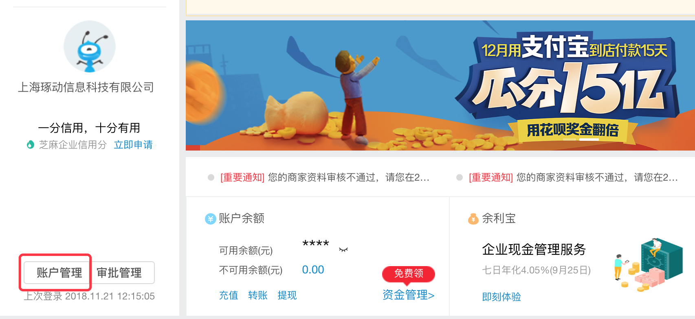
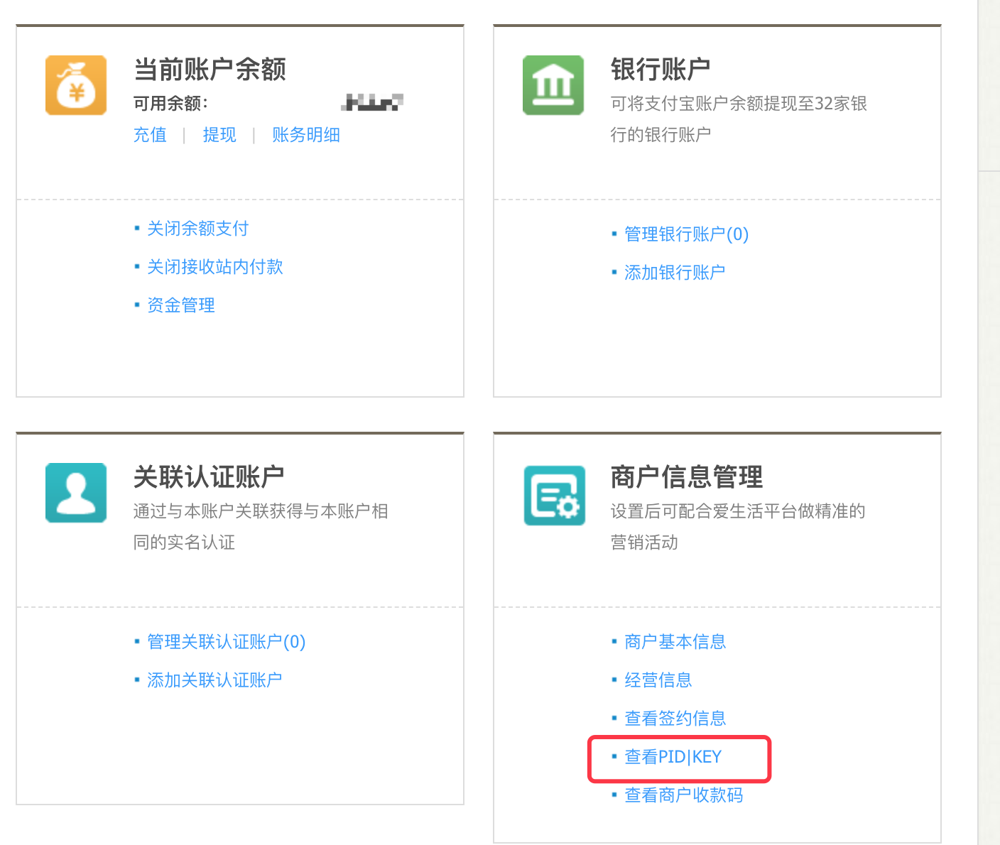
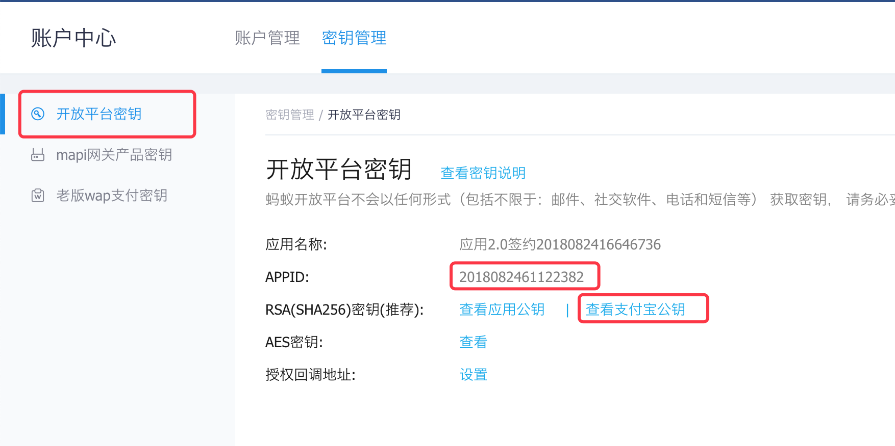

# 参数获取
支付宝支付功能，需使用如下核心参数。
- appid
- private_key
- alipay_public_key

### 参数首次设置
- 请直接参考支付宝官方说明

### 参数获取
- private_key(使用秘钥工具生成，需开发者自己存储,支付时需要)

#### 支付宝获取
- appid (APPID)
- alipay_public_key(支付宝公钥)

