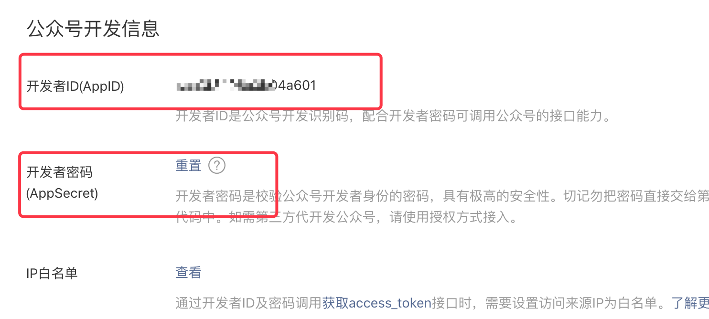
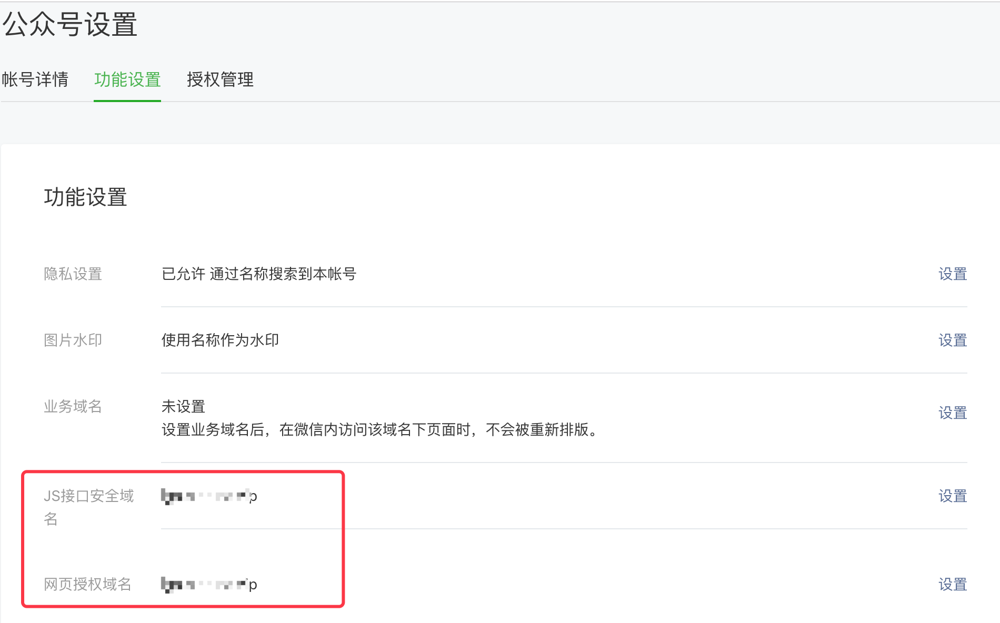
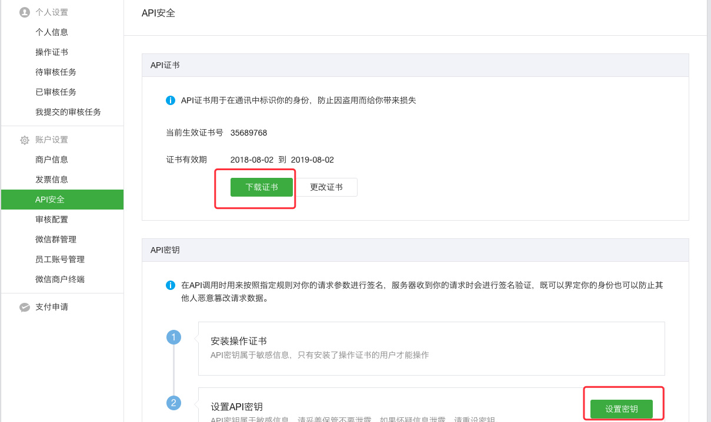

# 参数获取
微信支付，使用如下核心参数。
- APPID
- AppSecret
- MCH_ID(商户号)
- API_KEY(API秘钥)
- P12安全证书文件

### 公众号平台(http://mp.weixin.qq.com/)
#### 开发->基本设置
- APPID
- AppSecret

#### 设置->公众号设置->功能设置
- 网页授权获取用户基本信息(用于公众号支付)

### 商户平台(https://pay.weixin.qq.com)
- MCH_ID(商户号)
####  账户设置->商户信息

#### 账户设置->API安全
- API_KEY(API秘钥)
- P12安全证书文件
