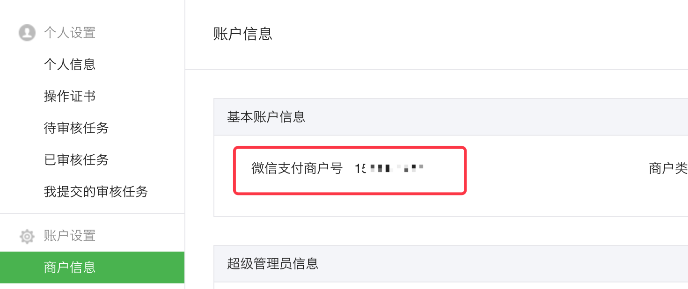

# 参数及配置
微信支付，使用如下核心参数。
- APPID
- AppSecret
- MCH_ID(商户号)
- API_KEY(API秘钥)
- P12安全证书文件

### 公众号平台(http://mp.weixin.qq.com/)
#### 开发->基本设置
- APPID
- AppSecret

#### 设置->公众号设置->功能设置
- 网页授权获取用户基本信息(用于公众号功能开发,比如分享,扫一扫等)

### 商户平台(https://pay.weixin.qq.com)
- MCH_ID(商户号)
####  账户设置->商户信息

#### 账户设置->API安全
- API_KEY(API秘钥)
- P12安全证书文件

#### 产品中心->开发配置->支付配置
- 公众号支付授权目录设置

- 这里授权目录是指使用公众号支付的页面,也就是用户打开画面的URL，比如当前支付的页面是 http://wwww.xxx.com/mall/pay.html ,微信的授权目录配置为:http://wwww.xxx.com/mall/

